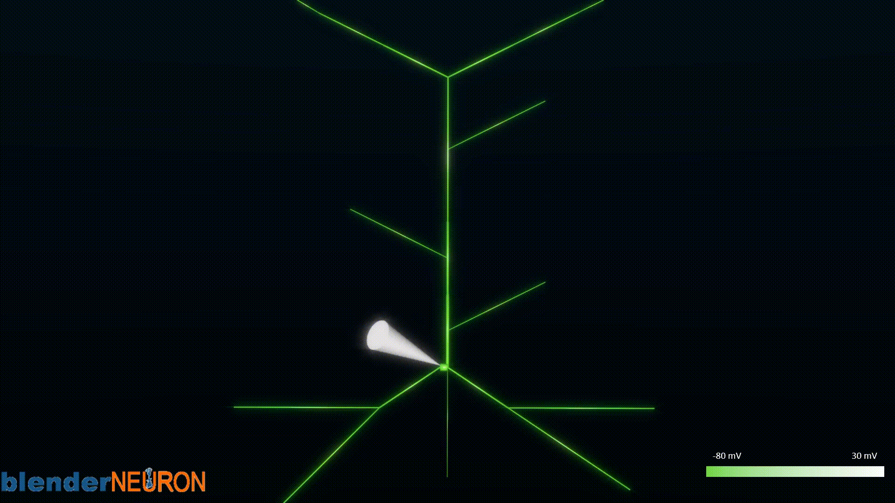

# HippoUnit
This package contains the source code for [HippoUnit](https://github.com/KaliLab/hippounit)-validated CA1 pyramidal cell models. There are 4 models with reduced morphology and one model with complete morphology. The package is associated with a paper: [A new reduced-morphology model for CA1 pyramidal cells and its validation and comparison with other models using HippoUnit](https://www.nature.com/articles/s41598-021-87002-7)

## Models tested
Five compartmental models of the CA1 pyramidal cell were used for testing. Models are available in the [ModelDB repository](https://senselab.med.yale.edu/ModelDB/). Our new model has been optimized based on HippoUnit tests, the others were not and hence served as controls. The model of Migliore et al. (2018) has been previously tuned for selected features of the somatic feature test and was therefore included as a reference (benchmark) model.

The **Cutsuridis et al. (2010) — C10 model** is a reduced-morphology model of CA1 pyramidal cell. The model has been used in circuit models with realistic spike timing of several hippocampal neuron types with respect to theta rhythm. The model simulated input pattern recall and storage in the CA1.

(Cutsuridis, V., Cobb, S. & Graham, B. P. Encoding and retrieval in a model of the hippocampal CA1 microcircuit. Hippocampus 20, 423–446 (2010); ModelDB accession number: 123815)

The **Cutsuridis and Poirazi (2015) — CP15 model** is a reduced-morphology model of the CA1 pyramidal cell. The model has been used in circuit models with realistic spike timing of several hippocampal neuron types with respect to theta rhythm. The model simulated long latencies of hippocampal cell activities in the entorhinal-hippocampal network due to theta modulated inhibition.

(Cutsuridis, V. & Poirazi, P. A computational study on how theta modulated inhibition can account for the long temporal windows in the entorhinal–hippocampal loop. Neurobiol. Learn. Memory 120, 69–83 (2015); ModelDB accession number: 181967)

The **Migliore et al. (2018) — M18 model** is a full-morphology model of CA1 pyramidal cell which is the result of a recent study that analyzed variability in the peak specific conductance of ion channels in individual CA1 neurons. This model is an example from a set of morphologically and biophysically accurate models that was generated.

(Migliore, R. et al. The physiological variability of channel density in hippocampal CA1 pyramidal cells and interneurons explored using a unified data-driven modeling workflow. PLoS Comput. Biol. 14, (2018); ModelDB accession number: 244688)

The **Turi et al (2019) — Tu19 model** is a reduced-morphology model of CA1 pyramidal cell. The model has been used within a hippocampal circuit model that has predicted the role of disinhibition in goal-directed spatial learning.

(Turi, G. F. et al. Vasoactive intestinal polypeptide-expressing interneurons in the hippocampus support goal-oriented spatial learning. Neuron 101, 1150-1165.e8 (2019); ModelDB accession number: 244688).

The **Tomko et al. (2021) — To21 model** is our new reduced-morphology model of CA1 pyramidal cell. The model was inspired mainly by the C10 model. Passive and active properties were adapted from the M18 model. We used a trial-and-error approach to manually optimize our model. Instead of tuning the individual parameters randomly, we adapted the active and passive properties from the established full-morphology M18 model. With this strategy, we created a realistic hybrid model with reduced morphology. The goal of the optimization process was to achieve a final score of less than 2 in each HippoUnit test.

(Tomko, M., Benuskova, L. & Jedlicka, P. A new reduced-morphology model for CA1 pyramidal cells and its validation and comparison with other models using HippoUnit. Sci Rep 11, 7615 (2021); ModelDB accession number: 266901)

## Visualization of the To21 model and its activity

## Paper
The *paper* folder of this repository contains python scripts and files needed for generating figures used in our [paper](https://www.nature.com/articles/s41598-021-87002-7).

## Target features
The *target_features* folder of this repository contains the target experimental data to each tests of HippoUnit in JSON files to which the models' behaviour are compared quantitatively.

## Validation results
The *validation_results* folder of this repository contains all the outputs of the tests of HippoUnit that were obtained by running HippoUnit tests.

## Acknowledgments
We acknowledge the financial support from the National Scholarship Programme of the Slovak Republic provided by the Slovak Academic Information Agency (SAIA) to M.T. This work was supported by BMBF (No. 031L0229—HUMANEUROMOD) to P.J. We thank Julia Muellerleile and Nick Hananeia for reading the manuscript.
